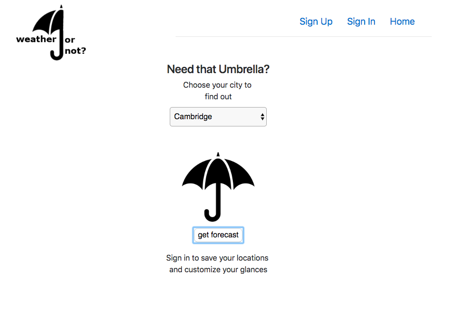

# Weather...or Not
  Weather or Not is a web application designed to provide the user with only
  the information they need to go about their day unencumbered be dampness.
  Communicating with the Dark Sky API through it's [custom server](https://github.com/SimonPringleWallace/weather-or-not-api) hosted on
  Heroku, weather or not recieves back forecasts and parses them for you to
  determine whether there'll be weather. If there's rain in the forecast, the
  user is alert by an image of an umbrella, if rain is not predicted, the user
  is greeted by a smiling cartoon sun.

  While the [Dark Sky API](https://darksky.net/dev) provides excellent
  documentation and powerful information, on of the great challenges of the
  project was preparing information in such a way that it could be processed
  by Dark Sky. For this client side of the appliation, this involved passing
  functions as props in order to gather the necessary information from
  child components. Much of the heavy lifting however, existed in the
  weather-or-not-api itself, the deployed version of which may be reached [here](https://weather-or-not-api.herokuapp.com).

# Perdicting the weather is...well...a science
Not being a meteorologist myself, no small part of this project was determining
how to deliver the most accurate prediction to the client as to whether they
need their umbrella or not on the day. Originally, this would be a simple task,
I would take the Probabilty of Percipitation that came back from
Dark Sky and, if it was above 50% return true for needing an umbrella, and
otherwise return false, however...

##### A word about PoP
Most people (very reasonably) believe that that percentage sign next to that
image of rain on your weather app is the percent chance of percipitation- that
is, the percent chance that you will leave your house and get rained on. However,
the reality is much more nuanced. that % is, in fact, Percent OF Percipitation
or PoP and it follows a very specific formula:

> PoP = C x A where “C” = the confidence that precipitation will occur somewhere in the forecast area, and where “A” = the percent of the area that will receive measurable precipitation, if it occurs at all.
>
Matt Hardigree, What It Really Means When There's A 50 Percent Chance Of Rain
Gizmodo.com

So the next time you think to yourself,

> I'll leave this umbella at home, there's only a 30% chance of rain today,
>
check yourself. Given this formula, a forecaster
could be 100% certain that rain was going to fall on 30% of Boston and, although
that's only a 30% PoP, 30% of Boston would definately need umbrellas on that day
- and I wanted to make sure that they were covered (...so to speak).

##### Enter Barometric Pressure
While PoP may depend on several factors, barometric pressure is a constant.
Higher pressure (above 1014 millibars of mercury) means clear weather, while
lower pressure (1009 Millibars and below) is an indecator of bad weather (though
not necessarily rain). While making a rain prediction based off of PoP along
tended to produce inaccurate results, using barometric pressure tempers the calculation. For example, if the barometric pressure is 1015 but the percent percipition is 55% I'm not going to tell you that you need an umbrella becuase
the pressure is just too high for bad weather (probably one of those times where
the forecaster is only 55% certain that rain will fall on 100% of the town). Conversely, if the barometric pressure is below 1008 mb or the PoP is above 50%,
then it would seem more than likely that you'll need that umbrella on the day.

# Future Work
  With a basic proof-of-concept completed, work will begin next on refactoring
  the code that exists (which is not nearly as DRY as it could be) and building
  on additional features for the user. These would include:
   - The ability to add preferences for different weather conditions to an
     account and to have those preferences update the forecast output
     accordingly. For example, a user could input that they would like to
     wear a sweater if the outside temp is below 50 degrees and weather-or-not
     would alert them to this need in the same way that it does the need for
     an umbrella.

  - Improved accuracy - with the vast amount of information that Dark Sky
    returns from a GET request, more testing will need to be done to determine
    which datasets are the most accurate. Currently, Weather or Not uses the
    dailing summary to determine the forecast, however, this may change.

   -A search bar rather than a drop down for searching for a city or state

# Wireframes and User Stories

 - [Wireframes 1](./public/WON_homepage.png)
 - [Wireframes 2](./public/WON_signed_in_view.png)
 - 

 # User Stories
A User Can…
 - Perform standard user authentication actions, included changing their password
 - Can select the distilled weather report from any Massachusetts city.
 - Can view whether or not they need an umbrella in the city of their choice without signing in
 - Can add multiple locations to track in their account when they are signed in
 - Can edit and/or delete these locations
 - Can click on a location and have it reveal whether they will need an umbrella at that
  location or not.

V2

A user can…
- Add preferences to their account (temp when they would wear a sweater, temp when they’d wear  t-shirt, etc.) and be provided information based on these preferences as relates to the weather.

- See the distilled weather report for any city in the country.

# Technologies Used
- React.JS
- Javascript
- Git, GitHub and Git Hub Pages
- SCSS
- HashRouter

# Installation
- To access the code for this application please fork and clone this Repository
  or download the files.
  From the command line run:
- ```npm install``` to install all dependencies
- ```npm start``` Start a server on your local host by running
